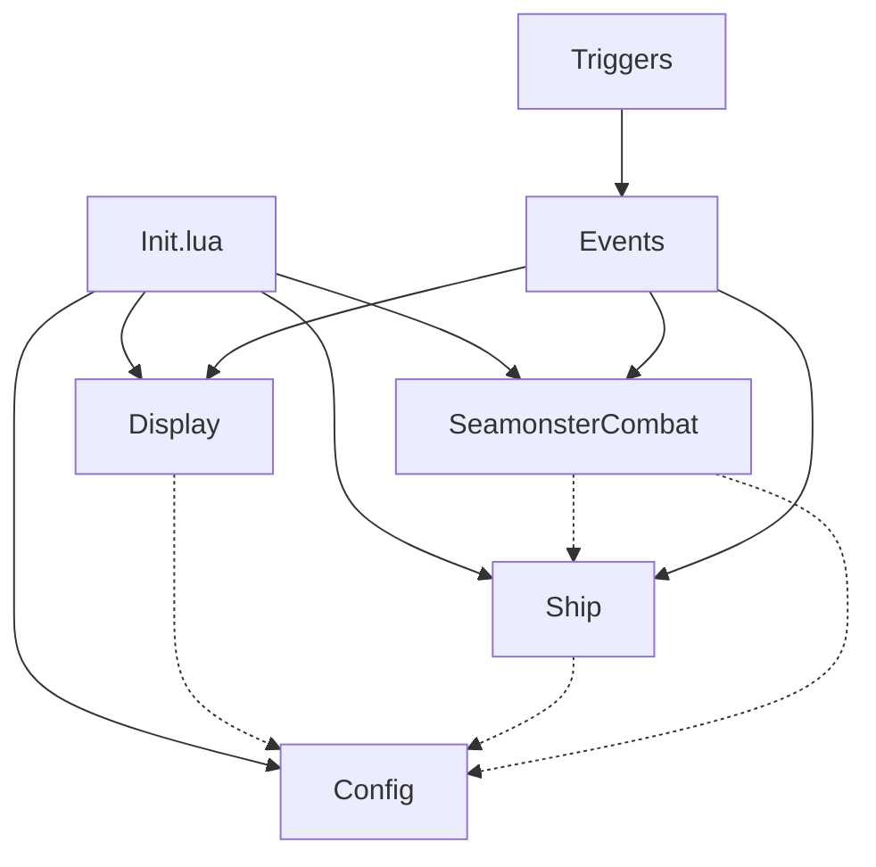
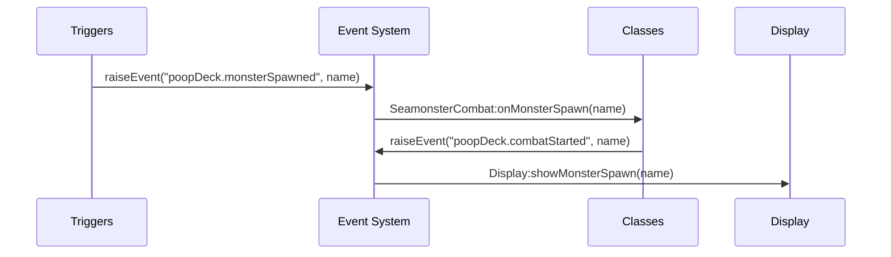
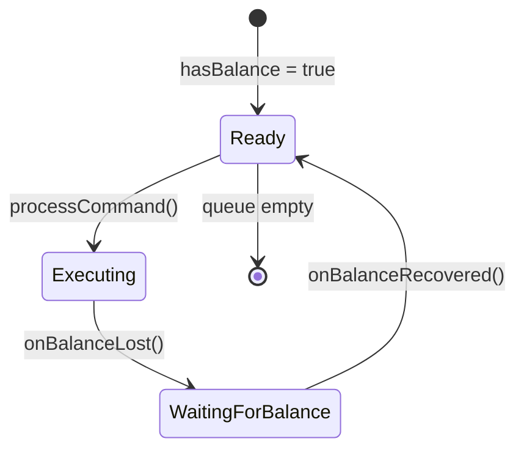

# poopDeck OOP Architecture Specification

## Overview

The poopDeck v2.0 architecture represents a complete transformation from procedural to object-oriented programming, designed using the Specflow methodology for AI-assisted software development. This document outlines the architectural decisions, patterns, and design principles that guide the system.

## Design Principles

### 1. Encapsulation
- Each class manages its own state and provides controlled access
- Private data is protected through closure patterns
- Public interfaces are clearly defined and documented

### 2. Separation of Concerns
- **Display**: Handles all UI rendering and formatting
- **Config**: Manages settings and persistence
- **Ship**: Controls vessel operations and state
- **Combat**: Manages seamonster encounters and automation

### 3. Event-Driven Architecture
- Components communicate through Mudlet's native event system
- Loose coupling between classes
- Extensible design for future enhancements

### 4. Backward Compatibility
- Existing procedural functions maintained through compatibility layer
- No breaking changes for existing users
- Progressive enhancement approach

## Class Architecture

### Class Hierarchy

```
poopDeck (namespace)
├── Display          # UI/UX Management
├── Config           # Settings & Persistence  
├── Ship             # Navigation & Operations
└── SeamonsterCombat # Combat Automation
```

### Dependency Graph



### Class Interfaces

#### Display Class
```lua
Display:new(config) -> Display
Display:showMessage(text, type, small)
Display:showVictory(monsterName)
Display:showMonsterSpawn(monsterName)
Display:framedBox(text, colorScheme, small)
Display:promptLine(text, colorType)
```

#### Config Class  
```lua
Config:new(filename) -> Config
Config:get(key) -> value
Config:set(key, value) -> Config
Config:save() -> void
Config:load() -> void
Config:validate() -> boolean, errors
```

#### Ship Class
```lua
Ship:new(config) -> Ship
Ship:turn(heading) -> Ship
Ship:setSpeed(speed) -> Ship
Ship:dock(direction) -> Ship
Ship:chain() -> ChainableInterface
Ship:parsePromptMatches(matches) -> Ship
Ship:getState() -> table
```

#### SeamonsterCombat Class
```lua
SeamonsterCombat:new(config, ship) -> SeamonsterCombat  
SeamonsterCombat:setWeapon(weapon) -> SeamonsterCombat
SeamonsterCombat:setAutoMode(enabled) -> SeamonsterCombat
SeamonsterCombat:fire() -> void
SeamonsterCombat:manualFire(ammoType) -> void
SeamonsterCombat:getCombatStatus() -> table
```

## Event System Architecture

### Event Flow Diagram



### Event Schema

#### Combat Events
- `poopDeck.monsterSpawned(monsterName: string)`
- `poopDeck.monsterKilled(monsterName: string)`
- `poopDeck.monsterKilledExternal()`
- `poopDeck.shotHit(monsterName: string)`
- `poopDeck.weaponFired(weaponType: string)`
- `poopDeck.outOfRange()`
- `poopDeck.shotInterrupted()`

#### Ship Events  
- `poopDeck.shipBalanceRecovered()`
- `poopDeck.shipBalanceLost()`
- `poopDeck.promptUpdate(promptData: table)`
- `poopDeck.shipTurning(direction: string)`
- `poopDeck.speedChanged(speed: string)`
- `poopDeck.shipDocked(direction: string)`

#### System Events
- `poopDeck.initialized(version: string)`
- `poopDeck.configChanged(key: string, value: any)`
- `poopDeck.modeChanged(mode: string)`

### Event Handler Patterns

#### Standard Handler Registration
```lua
registerAnonymousEventHandler("poopDeck.eventName", function(event, ...)
    self:handleEvent(...)
end)
```

#### Event Broadcasting  
```lua
function Class:performAction()
    -- Do work
    raiseEvent("poopDeck.actionCompleted", result)
    return self
end
```

## State Management

### Ship State Model
```lua
state = {
    -- Navigation
    currentSpeed: string,
    currentHeading: string, 
    actualSpeed: number,
    
    -- Equipment
    anchored: boolean,
    plankLowered: boolean,
    commScreenRaised: boolean,
    
    -- Environment
    windDirection: string,
    windSpeed: number,
    seaCondition: string,
    
    -- Status
    hasBalance: boolean,
    needsMaintenance: boolean
}
```

### Combat State Model
```lua
state = {
    -- Combat Status
    inCombat: boolean,
    currentMonster: string,
    shotsFired: number,
    shotsRemaining: number,
    
    -- Firing State
    isFiring: boolean,
    outOfRange: boolean,
    
    -- Automation
    mode: "manual" | "automatic",
    autoFireEnabled: boolean
}
```

## Command Queue System

### Balance Management Architecture

The ship command queue system addresses the game's balance mechanics where commands must wait for the crew to be ready.

#### Queue Processing Flow


#### Method Chaining Implementation
```lua
-- Immediate execution (old way)
ship:turn("north")

-- Queued execution with chaining  
ship:chain()
    :castOff()
    :setSpeed("full")
    :turn("north")
    :execute()
```

#### Balance Detection
- Trigger: `"The crew of your ship is now ready to execute another order."`
- Event: `poopDeck.shipBalanceRecovered`
- Auto-processing: Queue continues when balance recovered

## Display System Architecture

### Template-Based Rendering

The display system uses pre-calculated templates for maximum efficiency.

#### Template Structure
```lua
templates[colorScheme] = {
    topLine: string,        -- Pre-built header
    emptyLine: string,      -- Pre-built spacer
    textLineFormat: string, -- Format string for text
    bottomLine: string,     -- Pre-built footer
    colors: table          -- Color reference
}
```

#### Performance Optimizations
- **Color Inheritance**: Base colors shared across schemes
- **Static Pre-calculation**: Templates built once at initialization
- **String Format**: Use `string.format()` instead of concatenation
- **Emoji Optimization**: Simplified UTF-8 detection

## Error Handling Strategy

### Defensive Programming Patterns

#### Input Validation
```lua
function Ship:turn(heading)
    if not heading then
        error("Ship:turn() requires a heading parameter")
    end
    
    local direction = self.directions[heading:lower()]
    if not direction then
        error("Invalid heading: " .. tostring(heading))
    end
    -- ...
end
```

#### Graceful Degradation
```lua
-- Check for object existence
if poopDeck.ship then
    poopDeck.ship:turn(heading)
else
    echo("poopDeck: Ship not initialized\n")
end
```

#### State Cleanup
```lua
function SeamonsterCombat:cleanupCombat()
    -- Cancel all timers
    if self.state.fireTimer then
        killTimer(self.state.fireTimer)
    end
    
    -- Reset state flags
    self.state.inCombat = false
    self.state.isFiring = false
    -- ...
end
```

## Integration Patterns

### Muddler Integration

#### File Structure
```
src/
├── scripts/Classes/scripts.json    # Class registration
├── triggers/*/triggers.json        # Trigger definitions
└── aliases/*/aliases.json          # Alias definitions
```

#### Build Process
1. `muddle` command processes JSON files
2. Creates Mudlet-compatible XML
3. Packages into .mpackage file
4. Maintains file relationships

### Backward Compatibility Layer

#### Function Delegation
```lua
-- Compatibility function
function poopDeck.turnShip(heading)
    if poopDeck.ship then
        poopDeck.ship:turn(heading)
    end
end

-- Direct OOP usage
poopDeck.ship:turn(heading)
```

#### Progressive Enhancement
- New features available through OOP interface
- Existing functionality preserved
- No breaking changes for users

## Testing Strategy

### Manual Testing Approach

#### Component Testing
1. **Display System**: Visual verification of output
2. **Config System**: Save/load functionality
3. **Ship Operations**: Command execution and queueing  
4. **Combat System**: Monster tracking and automation

#### Integration Testing
1. **Event Flow**: Trigger → Event → Class response
2. **State Synchronization**: Prompt updates reflected in classes
3. **Error Handling**: Graceful failures and recovery

#### System Testing
1. **Full Workflow**: Sailing → Combat → Victory
2. **Edge Cases**: External kills, interrupted actions
3. **Performance**: Display rendering under load

### Debugging Tools

#### Status Commands
```lua
poopDeck.status()           -- System overview
ship:getState()             -- Ship state dump
combat:getCombatStatus()    -- Combat status
#ship.commandQueue          -- Queue length
```

#### Event Tracing
```lua
-- Custom event logger (optional)
registerAnonymousEventHandler("*", function(event, ...)
    print("Event:", event, ...)
end)
```

## Performance Considerations

### Memory Management
- Template reuse minimizes string creation
- Event handlers use closures efficiently
- Timer cleanup prevents resource leaks
- State objects sized appropriately

### Execution Efficiency  
- Pre-calculated static elements
- Minimal string operations in hot paths
- Efficient data structures (tables vs arrays)
- Lazy initialization where appropriate

### Network Efficiency
- Command queueing prevents spam
- Balance detection reduces failed commands
- Prompt parsing minimizes trigger overhead

## Future Architecture Considerations

### Extensibility Points
1. **Plugin System**: Event-based architecture supports plugins
2. **Custom Ship Types**: Inheritance patterns allow specialization
3. **Display Themes**: Template system supports customization
4. **Combat Strategies**: Pluggable automation algorithms

### Scalability Patterns
1. **Multi-Profile Support**: Instance isolation
2. **Fleet Management**: Multiple ship objects
3. **Advanced Automation**: State machine patterns
4. **Performance Monitoring**: Metrics collection

### Technology Evolution
1. **Mudlet Updates**: API compatibility layers
2. **Lua Enhancements**: Modern language features
3. **Game Changes**: Adaptable trigger patterns
4. **User Needs**: Extensible class hierarchy

---

This architecture provides a solid foundation for current functionality while enabling future enhancements through clean abstractions and extensible patterns.